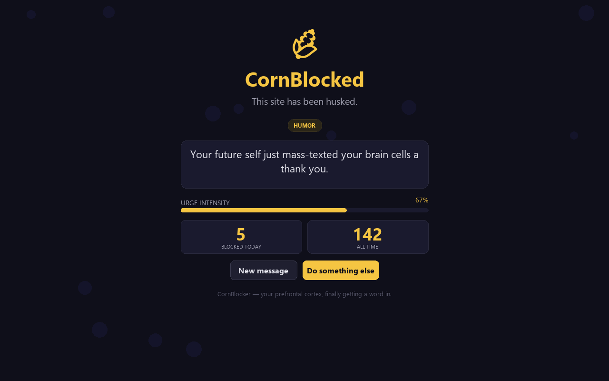
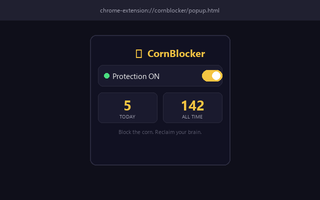

# CornBlocker

Block adult content with humor instead of shame. Your prefrontal cortex, finally getting a word in.

[](https://chromewebstore.google.com)


> **Note:** CornBlocker is currently under review on the Chrome Web Store. The link will be added here once approved.

## What It Does

CornBlocker is a Chrome extension that blocks 80+ adult websites and replaces them with a funny, encouraging blocked page — no shame, no guilt, just a corn emoji and some real talk.

**Three layers of protection:**

1. **Domain Blocklist** — 80+ adult sites blocked at the network level via `declarativeNetRequest` before the page even loads
2. **Reddit NSFW Detection** — Auto-detects NSFW subreddits using Reddit's own `over_18` API flag + DOM indicators
3. **Twitter/X Sensitive Content** — Hides sensitive media tweets inline and blocks sensitive profile pages

## Screenshots

| Blocked Page | Popup | Message Variants |
|:---:|:---:|:---:|
|  |  |  |

## Features

- 50 rotating motivational messages across 5 categories (humor, identity, science, action, perspective)
- Urge timer that shows the feeling peaks then passes
- Daily + all-time block counter
- Simple on/off toggle in the toolbar popup
- 100% local — zero data collection, zero accounts, zero network requests
- Open source

## Install

**From the Chrome Web Store:**

<!-- TODO: Replace with actual link once approved -->
*Link coming soon — currently under review.*

**From source (developer mode):**

1. Clone this repo
2. Open `chrome://extensions/` in Chrome
3. Enable **Developer mode** (top right)
4. Click **Load unpacked** and select the `cornblocker` folder
5. Done — visit a blocked site to see it in action

## How It Works

```
User navigates to blocked site
        |
        +-- Layer 1: declarativeNetRequest checks domain
        |   \-- Match? -> Redirect to blocked.html
        |
        +-- Layer 2: Reddit content script (reddit.com only)
        |   \-- Fetches /r/{sub}/about.json -> over_18 = true? -> Redirect
        |
        \-- Layer 3: Twitter content script (x.com/twitter.com only)
            \-- Sensitive media warning detected? -> Hide + show corn notice
```

The blocked page displays a random motivational message, an urge intensity timer, and your block stats. Two buttons: **New message** (get a different message) and **Do something else** (go to google.com).

## Project Structure

```
cornblocker/
├── manifest.json           # Extension config (Manifest V3)
├── rules.json              # declarativeNetRequest blocked domains (80+)
├── background.js           # Service worker (4chan path blocking, toggle)
├── blocked.html/css/js     # The blocked page experience
├── popup.html/css/js       # Toolbar popup (toggle + stats)
├── content-reddit.js       # Reddit NSFW subreddit detection
├── content-twitter.js      # Twitter/X sensitive content filter
├── icons/                  # Extension icons (16, 48, 128, 256)
├── store-assets/           # Chrome Web Store graphics
├── scripts/                # Dev tools (icon + asset generators)
├── docs/                   # Planning docs, store listing copy
└── PRIVACY.md              # Privacy policy
```

## Privacy

CornBlocker collects **zero** user data. All stats are stored locally on your device. No servers, no analytics, no accounts, no tracking. See [PRIVACY.md](PRIVACY.md) for the full policy.

## Tech Stack

- Chrome Extension Manifest V3
- `declarativeNetRequest` for network-level blocking
- Vanilla HTML/CSS/JS — no frameworks, no build step
- `chrome.storage.local` for local persistence
- Python PIL/Pillow for icon generation (dev tool only)

## Contributing

Issues and PRs welcome. The extension has no build step — edit files, reload the extension in `chrome://extensions/`, and test.

## License

MIT
